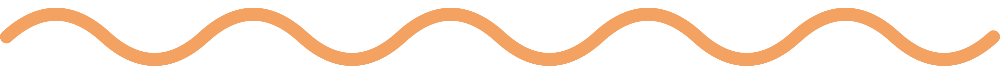
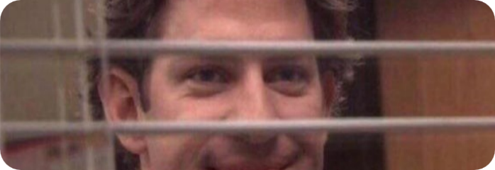
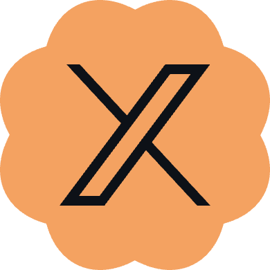
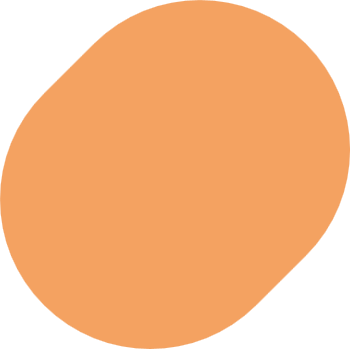

<h3 align="center">
  <b>Bonjour <🥖></b>
</h3>

  Je suis Adem Othman, a tunisian student. and an Internet lover.

  

  I'm genuinely passionate about delving deeper into the world of the internet, staying updated on cutting-edge technologies, and constantly seeking new knowledge.

  

  

  Feel free to check my links below.

&nbsp;
&nbsp;

&nbsp;
&nbsp;

  <i>
    Btw i'm in love with Material Design by Google (●'◡'●)
  </i>

  

  ReactJS • ExpressJS • Tailwind • Flutter • Arduino • Python • Figma • PowerPoint

  

